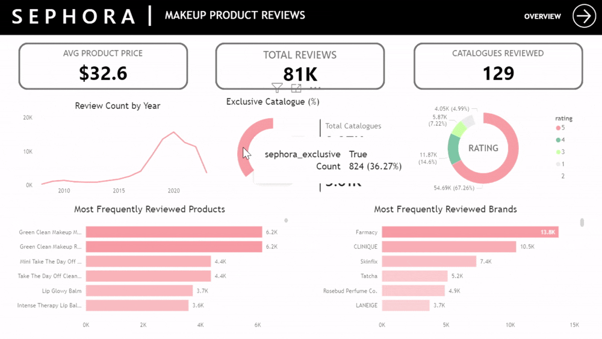
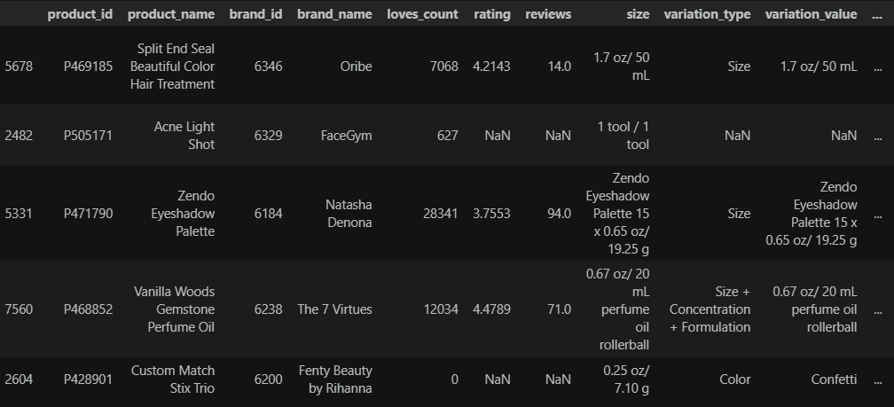
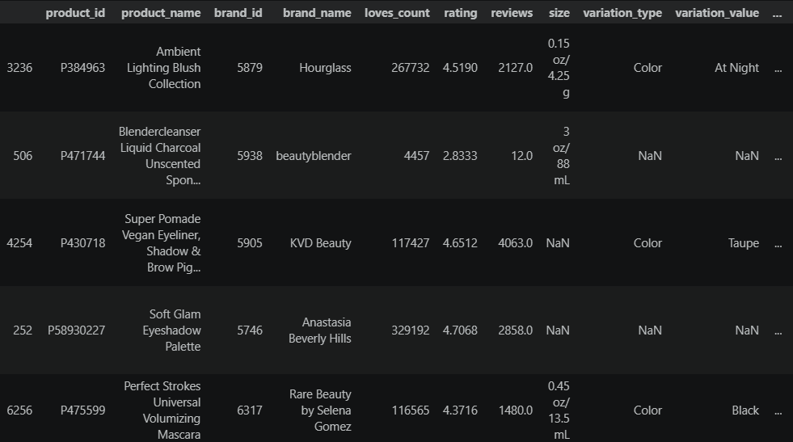
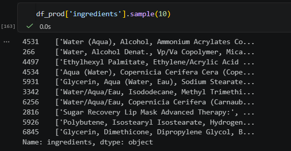
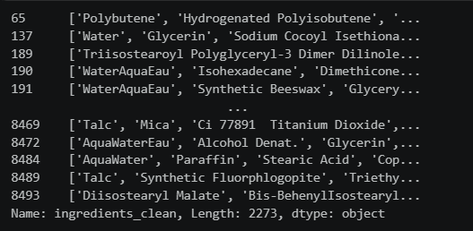
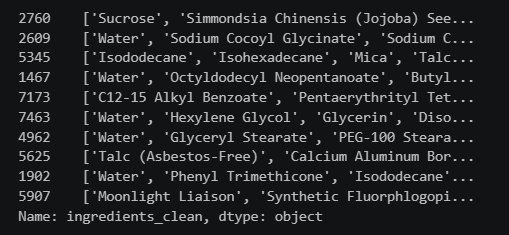
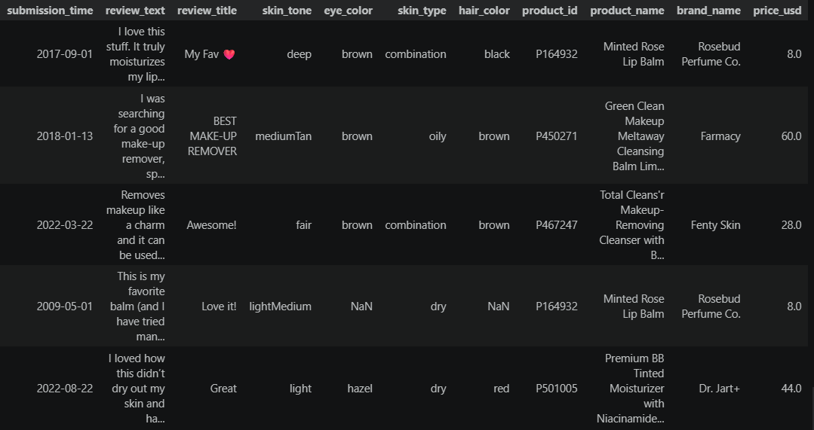
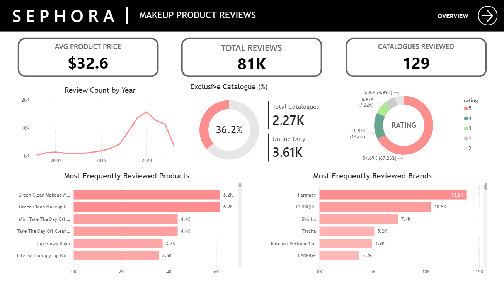
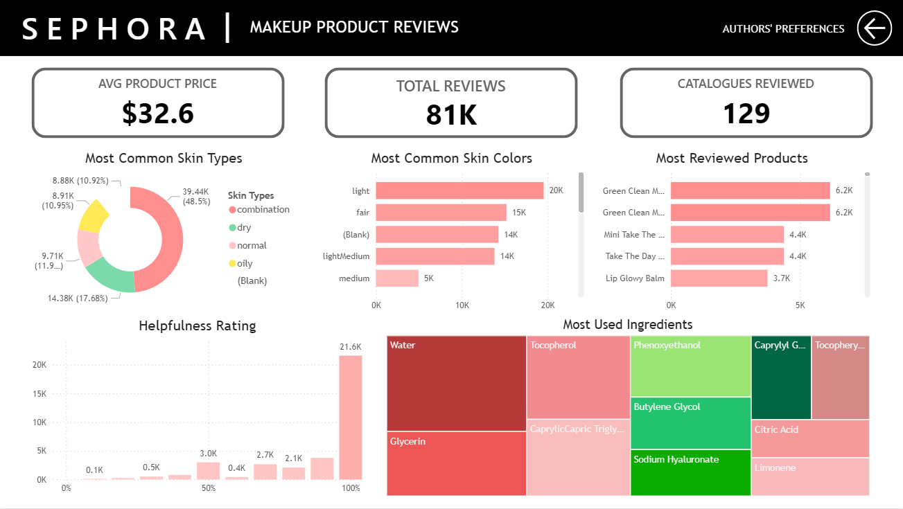

# **SEPHORA MAKEUP PRODUCT REVIEWS DASHBOARD**

### _Preview_

_Please wait for the preview to showup_. <br> _The dashboard `.pbix` file can be accessed in [here](2_notebook\makeup_cleaning.ipynb)_


# A. Introduction

Hello, I am Lesmana Adhe Wijaya, a 23 years old from Indonesia. In this project, I created a Sephora product review dashboard using Python (data cleaning) and Power BI (visualization).

Contact:
- LinkedIn: https://www.linkedin.com/in/lesmanaadhew/
- Email: lesmanaadhew@gmail.com

## 1. Background

**Sephora** is a French multinational company that focuses on cosmetics and beauty products retail. The company operates in 34 countries worldwide through online and physical stores.

Sephora also has an online platform where customers are able to leave reviews about the products. In this project, I visualized Sephora's customer reviews in Power BI to better understand customer preferences. Although, this project will only focus on makeup product reviews.

### a. Dataset source

The dataset used in this project is provided by `NANDY INKY` in Kaggle. The dataset can be accessed through [here](https://www.kaggle.com/datasets/nadyinky/sephora-products-and-skincare-reviews).

The datasets from the link above consist of two parts.
1. The first one is the product dataset named `product_info.csv`
2. The second one is the review dataset, which is divided into 5 different files.
    - reviews_0-250.csv
    - reviews_250-500.csv
    - reviews_500-750.csv
    - reviews_750-1250.csv
    - reviews_1250-3nd.csv

_Notes:_
- _Since GitHub has an upload size limitation, the raw datasets can only be downloaded from Kaggle through the link above._
- _For altering the dashboard in Power BI, read the `dashboard_alteration.txt` inside the `3_dashboard` folder [here](3_dashboard\dashboard_alteration.txt)_

### b. Tools and software

Only two tools are used in this project:
1. **Python**: mainly used for data cleansing
2. **Power BI**: used to create the dashboard

### c. Questions

Here are several key questions that need to be addressed to create a functional makeup product reviews dashboard.
1. How many reviews are about makeup products?
2. How many catalogues are reviewed in the website?
3. How was the performance of the products?
4. What were the review authors' skin characteristics?
5. What were the most frequently used ingredients in the products?


# B. Data Cleaning (Key Steps Only)

The datasets need to be cleaned before it's visualized in Power BI. Since the raw datasets include information and reviews of all cosmetics and beauty products, they need to be cleaned to retain only makeup products. The following are several key data cleaning steps that I used to clean the datasets.

_Note: the full data cleaning notebook can be accessed through [2_notebook](2_notebook/makeup_cleaning.ipynb) folder or my [Kaggle code](https://www.kaggle.com/code/lesmanaadhew/data-cleaning-sephora-makeup-product-reviews)_

## 1. Product Dataset

### a. Makeup product filtering

The dataset sample before filtering: <br> 


Filtering code:
```Python
filter_makeup_up = ['Foundation', 'Concealer', 'Powder', 'Blush', 'Bronzer', 'Highliter', 'Primer', 'Eyeshadow', 'Eyeliner', 'Mascara', 'Pencil', 'Eyebrow', 'Lip', 'Lipstick', 'Liner', 'Setting', 'Countour', 'BB', 'CC', 'Tinted', 'Makeup', 'Brush', 'Brow', 'Sponge', 'Pomade', 'Stain', 'Translucent', 'Blush', 'Compact', 'Powder', 'Plumper', 'Eyelashes', 'Finishing']

filter_makeup = filter_makeup_up + [x.lower() for x in filter_makeup_up]

df_prod = df_prod[df_prod['product_name'].str.contains('|'.join(filter_makeup))]
```

After filtering: <br> 


### b. Fix columns with boolean values

There are 5 columns that are supposed to be identified of having boolean values, because the non-null values only consist of `0` or `1`.

Code used:
```Python
df_prod['limited_edition'] = df_prod['limited_edition'].astype(bool)
df_prod['new'] = df_prod['new'].astype(bool)
df_prod['online_only'] = df_prod['online_only'].astype(bool)
df_prod['out_of_stock'] = df_prod['out_of_stock'].astype(bool)
df_prod['sephora_exclusive'] = df_prod['sephora_exclusive'].astype(bool)
```

### c. Clean the `ingredients` column

The `ingredients` column contains a significant amount of unused characters, such as `\`, `:`, `;`, etc. that should be eliminated or replaced with functional value, like `/`, `,`.

The column also contains a lot of unnecessary repeatedly `water` values within the same rows, such as `'Water (Aqua)'`, `'Water/Aqua/Eau'`, and others.

Here is the sample before it is cleaned: <br>


The following is the code used to clean the column:
```Python
# replace \ with /
df_prod['ingredients_clean'] = (df_prod['ingredients']
    .apply(lambda x: x.replace(r'\\', '/')
    .replace('\\', '/')
    .replace("'Cheek Pop:', ", '') if pd.notna(x) else x))

# remove and/or replace unused characters
df_prod['ingredients_clean'] = df_prod['ingredients_clean'].astype(str).replace(r";", ",", regex=True).replace([r"[^\w.,\- ()]"], "", regex=True)
df_prod['ingredients_clean'] = df_prod['ingredients_clean'].replace(r", ", "', '", regex=True)
df_prod['ingredients_clean'] = "['" + df_prod['ingredients_clean'] + "']"
```

The result after above step: <br>


It still has uncleaned `Water` values. The following are the code used to clean the `Water` values.

```Python
list_water = ["Eau", "Aqua"]
list_water_2 = ["WaterWaterWater", "WaterWater"]

df_prod['ingredients_clean'] = (df_prod['ingredients_clean']
    .replace(list_water, "Water", regex=True)
    .replace(list_water_2, "Water", regex=True))

df_prod['ingredients_clean'] = (df_prod['ingredients_clean']
    .replace(r"Water\s*\(Water\)?", "Water", regex=True)
    .replace(r"Water',\s*'Water\)", "Water", regex=True))
```

The final `ingredient` values after cleaned: <br>



## 2. Review Dataset

### a. Makeup product filtering

The review dataset should include only the makeup product reviews.

```Python
filter_product = df_prod['product_id'].unique().tolist()
df_rev = df_rev[df_rev['product_id'].str.contains('|'.join(filter_product))]
```

Here is the dataset sample after filtering:



# C. Data Visualization

To visualize the dataset, I created the dashboard into two different pages. Both of the pages include the same 3 KPI cards, namely `avg product price`, `total reviews`, and `catalogues reviewed`. 

The first page is an overview of the reviews. Furthermore, it visualizes several metrics related to catalogue information and review performance.



The second page is a more detailed page that focuses more to visualize authors' characteristics and preferences.


